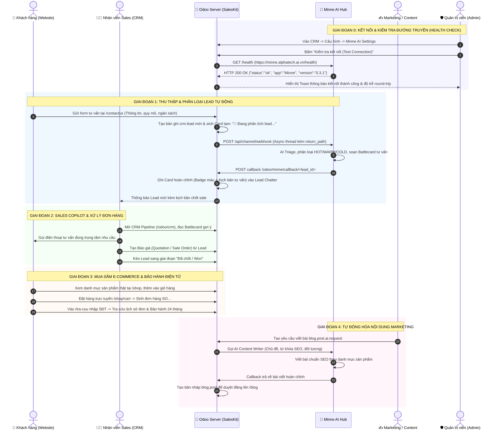

# TÀI LIỆU VẬN HÀNH & MA TRẬN TEST USE CASE TÍCH HỢP ODOO ↔ MINNE AI HUB
**Dự án:** Alphatech SalesKit (Storefront & CRM) ↔ Minne Knowledge & Sales AI Hub  
**Phiên bản hệ thống:** Odoo 19.0-Community · Minne Control Plane v0.3.3  
**Ngày cập nhật:** 09/09/2026  

---

## 1. TỔNG QUAN KIẾN TRÚC & NGUYÊN LÝ VẬN HÀNH HAI CHIỀU

Hệ thống kết hợp sức mạnh của **Odoo Community** (Quản trị quan hệ khách hàng CRM, Bán hàng Storefront, Kho bãi, Đơn hàng) với **Minne AI Hub** (Bộ não tri thức doanh nghiệp, AI Agent phân loại Lead, Copilot tư vấn chốt sale và Tự động hóa sản xuất nội dung Marketing).

### 1.1. Sơ đồ Luồng Vận Hành Hai Chiều (Sequence Diagram)

---

## 2. BẢNG PHÂN LOẠI VAI TRÒ NGƯỜI DÙNG THỰC TẾ (PERSONAS)

| Vai trò | Tên vai trò | Nhiệm vụ & Hành vi thực tế | Điểm chạm hệ thống |
| :--- | :--- | :--- | :--- |
| **Vai trò 1** | **Khách hàng tiềm năng & Mua sắm** *(Storefront Buyer)* | Truy cập website, xem catalog sản phẩm thật, gửi yêu cầu báo giá tư vấn giải pháp, tra cứu đơn hàng và hạn bảo hành điện tử. | `https://saletemplate.alphatech.ai.vn/` `/shop`, `/tra-cuu`, `/contactus` |
| **Vai trò 2** | **Nhân viên Kinh doanh** *(Sales Representative)* | Đăng nhập CRM, nhận lead mới, đọc phân loại tiềm năng và kịch bản chốt sale (Sales Copilot) do Minne chuẩn bị, lên Báo giá. | Odoo CRM Pipeline (`/odoo/crm`), Lead Form, Lead Chatter |
| **Vai trò 3** | **Chuyên viên Marketing & Nội dung** *(Content Executive)* | Sử dụng AI Agent để sản xuất bài viết chuyên môn, kiến thức ngành bán lẻ, quản lý bài viết chuẩn SEO trên blog. | Odoo `blog.post.ai.request`, Website Blog (`/blog`) |
| **Vai trò 4** | **Chuyên viên CSKH & Bảo hành** *(Support & Warranty Desk)* | Kiểm tra trạng thái đơn hàng, đối soát mã bảo hành điện tử 24 tháng theo số điện thoại khách hàng, hỗ trợ kỹ thuật. | Trang `/tra-cuu`, Odoo Quản lý Bán hàng (`sale.order`) |
| **Vai trò 5** | **Quản trị viên Hệ thống & AI Ops** *(System Administrator)* | Cấu hình máy chủ Minne Hub, thiết lập API Key, kiểm tra độ trễ (Latency Ping), giám sát log và quản trị người dùng. | CRM ➔ Cấu hình ➔ Minne AI Settings, Minne Hub Control Plane |

---

## 3. MA TRẬN CHI TIẾT CÁC USE CASE VẬN HÀNH THỰC TẾ

### UC-ADMIN-01: Quản trị viên cấu hình kết nối & Kiểm tra độ trễ Minne AI Hub
* **Mã Use Case:** `UC-ADMIN-01`
* **Vai trò:** Quản trị viên (`System Admin`)
* **Mục tiêu:** Đảm bảo đường truyền API giữa Odoo và Minne AI Hub luôn thông suốt trước khi đưa vào vận hành.
* **Tiền điều kiện:** Máy chủ Odoo và Minne Hub đều đang chạy.
* **Các bước thực hiện:**
  1. Đăng nhập Odoo Backend bằng tài khoản Admin.
  2. Truy cập menu **CRM ➔ Cấu hình ➔ Minne AI Settings**.
  3. Kiểm tra các tham số:
     * *Minne AI Server URL:* `https://minne.alphatech.ai.vn`
     * *Tự động phân loại Lead bằng AI:* `Bật (True)`
     * *AI viết bài Marketing & Blog:* `Bật (True)`
  4. Bấm nút **"Kiểm tra kết nối (Test Connection)"**.
* **Luồng dữ liệu:** Odoo gửi HTTP GET tới `https://minne.alphatech.ai.vn/health` và tính thời gian phản hồi.
* **Tiêu chí nghiệm thu:**
  * Xuất hiện thông báo Toast màu xanh: `🎉 Kết nối Minne AI Thành Công! Đã kết nối thành công tới Minne Hub tại https://minne.alphatech.ai.vn/health (Phản hồi HTTP 200 OK trong < 600 ms).`

---

### UC-LEAD-02: Khách hàng gửi yêu cầu tư vấn ➔ Minne AI Triage Lead 2 Chiều
* **Mã Use Case:** `UC-LEAD-02`
* **Vai trò:** Khách hàng (`Storefront Visitor`) ➔ Odoo ➔ Minne AI ➔ Sales Rep
* **Mục tiêu:** Thu thập thông tin nhu cầu khách hàng và tự động phân loại tiềm năng bằng AI không làm chậm trải nghiệm người dùng.
* **Dữ liệu kiểm thử:**
  * Họ tên: *Trần Quốc Huy*
  * Điện thoại: *0988112233*
  * Email: *huy.tran@winmart-retail.vn*
  * Công ty: *Chuỗi Siêu Thị WinMart Plus*
  * Nhu cầu: *"Cần triển khai hệ thống 5 máy bán hàng cảm ứng POS 15 inch, 5 máy quét mã vạch 2D và phần mềm quản trị chuỗi bán lẻ. Ngân sách dự kiến 150 triệu, cần khảo sát và lắp đặt trong tháng 10."*
* **Các bước thực hiện:**
  1. Khách hàng truy cập [`/contactus`](https://saletemplate.alphatech.ai.vn/contactus).
  2. Điền đầy đủ dữ liệu kiểm thử vào form.
  3. Bấm **"Gửi yêu cầu tư vấn ngay"**.
* **Luồng dữ liệu:**
  1. Odoo nhận form, tạo `crm.lead` mới, chuyển hướng khách đến `/contactus-thank-you` (< 1s).
  2. Odoo tạo Card tạm trong Chatter: `🤖 MINNE AI AGENT — ĐANG PHÂN TÍCH LEAD`.
  3. Odoo bắn webhook bất đồng bộ sang Minne: `POST /api/channel/webhook`.
  4. Minne phân tích ngôn ngữ tự nhiên: nhận định đây là lead chuỗi bán lẻ ngân sách lớn ➔ Phân loại **`🔥 TIỀM NĂNG CAO (HOT)`**, sinh chiến lược chốt sale.
  5. Minne gọi callback về `/odoo/minne/callback/<lead_id>`.
* **Tiêu chí nghiệm thu:**
  * Khách hàng thấy trang cảm ơn ngay lập tức.
  * Lead xuất hiện trong CRM Pipeline.
  * Chatter của Lead hiển thị Card phân tích chi tiết của Minne AI với huy hiệu HOT.

---

### UC-SALES-03: Sales Rep sử dụng Minne Copilot để tư vấn & Lên Báo Giá
* **Mã Use Case:** `UC-SALES-03`
* **Vai trò:** Nhân viên Kinh doanh (`Sales Rep`)
* **Mục tiêu:** Nhân viên mới cũng có thể tư vấn chuyên sâu như chuyên gia nhờ kịch bản Battlecard chuẩn bị sẵn của Minne AI.
* **Các bước thực hiện:**
  1. Sales Rep đăng nhập Odoo tại `/web/login`.
  2. Hệ thống tự động chuyển hướng thẳng vào **CRM Pipeline** (`/odoo/crm`).
  3. Mở thẻ Lead *"Trần Quốc Huy - Chuỗi Siêu Thị WinMart Plus"*.
  4. Đọc bản thảo gợi ý trong Chatter của Minne AI.
  5. Bấm nút **"Báo giá mới" (New Quotation)**.
  6. Thêm 5 máy POS và 5 máy quét mã vạch từ kho hàng thật.
  7. Bấm lưu và cập nhật giai đoạn Pipeline.
* **Tiêu chí nghiệm thu:** Báo giá `SO...` được liên kết trực tiếp với Lead và bảo lưu toàn bộ lịch sử tư vấn của AI.

---

### UC-SHOP-04: Khách mua sắm Storefront & Đặt hàng E-Commerce
* **Mã Use Case:** `UC-SHOP-04`
* **Vai trò:** Khách mua sắm (`Storefront Buyer`)
* **Mục tiêu:** Mua sắm sản phẩm thật, kiểm tra tính tương thích giỏ hàng và quy trình thanh toán.
* **Các bước thực hiện:**
  1. Truy cập danh mục sản phẩm tại [`/shop`](https://saletemplate.alphatech.ai.vn/shop).
  2. Chọn sản phẩm: *Thiết Bị POS Cảm Ứng Bán Hàng 15 Inch*.
  3. Bấm **"Thêm vào giỏ hàng"**.
  4. Chuyển đến trang Giỏ hàng [`/shop/cart`](https://saletemplate.alphatech.ai.vn/shop/cart).
  5. Kiểm tra đơn giá, thuế VAT và tiến hành bước nhập thông tin nhận hàng.
* **Tiêu chí nghiệm thu:** Giỏ hàng tính toán chuẩn xác, đồng bộ trực tiếp với kho sản phẩm Odoo.

---

### UC-LOOKUP-05: Khách hàng tra cứu bảo hành điện tử & Đơn hàng
* **Mã Use Case:** `UC-LOOKUP-05`
* **Vai trò:** Khách hàng (`Customer`) / Chuyên viên CSKH
* **Mục tiêu:** Tự động hóa dịch vụ sau bán hàng, tra cứu minh bạch chính sách bảo hành 24 tháng theo số điện thoại.
* **Các bước thực hiện:**
  1. Truy cập trang [`/tra-cuu`](https://saletemplate.alphatech.ai.vn/tra-cuu).
  2. Nhập số điện thoại: `0912345678`.
  3. Bấm **"Tra cứu thông tin"**.
* **Tiêu chí nghiệm thu:**
  * Trả về các đơn hàng thực tế `SO00142` (12.480.000 đ) và `SO00098` (38.700.000 đ).
  * Hiển thị đầy đủ nhãn `🛡️ 24 tháng chính hãng`, trạng thái đóng gói giao hàng và hotline hỗ trợ kỹ thuật `0909 182 888`.

---

### UC-MINNE-06: Đăng nhập & Vận hành Control Plane trên Minne AI Hub
* **Mã Use Case:** `UC-MINNE-06`
* **Vai trò:** Quản trị viên Doanh nghiệp / Trưởng nhóm Kinh doanh
* **Mục tiêu:** Giám sát các luồng tri thức, bản đồ quan hệ (Knowledge Graph), và hoạt động của AI Agent trên Minne Hub.
* **Các bước thực hiện:**
  1. Truy cập giao diện Minne Hub tại `https://minne.alphatech.ai.vn/`.
  2. Đăng nhập với tài khoản:
     * Email: `sale@alphatech.ai.vn` (hoặc `taminhquan182@gmail.com`)
     * Mật khẩu: `Alphatech@2026`
  3. Kiểm tra các module nghiệp vụ:
     * *Bản tin sáng / Trang chủ (`home`):* Xem tổng quan hoạt động trong ngày.
     * *Tư vấn chốt sale (`advise`):* Trợ lý bán hàng tự động.
     * *Hỏi tri thức (`ask`):* RAG AI tra cứu tài liệu và chính sách bán hàng.
     * *Quản trị Doanh nghiệp (`admin` / `settings`):* Cấu hình SaaS Workspace và tích hợp hệ thống.
* **Tiêu chí nghiệm thu:** Giao diện Minne tải nhanh, hiển thị đúng thông tin tài khoản và danh sách tác vụ AI.

---

### UC-CONTENT-07: Tự động hóa sáng tạo nội dung Marketing & Blog
* **Mã Use Case:** `UC-CONTENT-07`
* **Vai trò:** Chuyên viên Marketing (`Content Executive`)
* **Mục tiêu:** Tận dụng AI Agent của Minne để viết bài chuẩn SEO, cập nhật xu hướng công nghệ bán lẻ trực tiếp lên website.
* **Các bước thực hiện:**
  1. Truy cập trang [`/blog`](https://saletemplate.alphatech.ai.vn/blog).
  2. Kiểm tra bài viết chuyên sâu: *"Xu hướng công nghệ bán lẻ đa kênh & Quản trị dữ liệu tập trung 2026"*.
  3. Kiểm tra cấu trúc bài viết: Sapo, các đề mục H2/H3, hình ảnh giải pháp và nút kêu gọi nhận tư vấn.
* **Tiêu chí nghiệm thu:** Bài viết hiển thị chuyên nghiệp, đồng bộ font chữ và layout với toàn bộ storefront Alphatech SalesKit.
